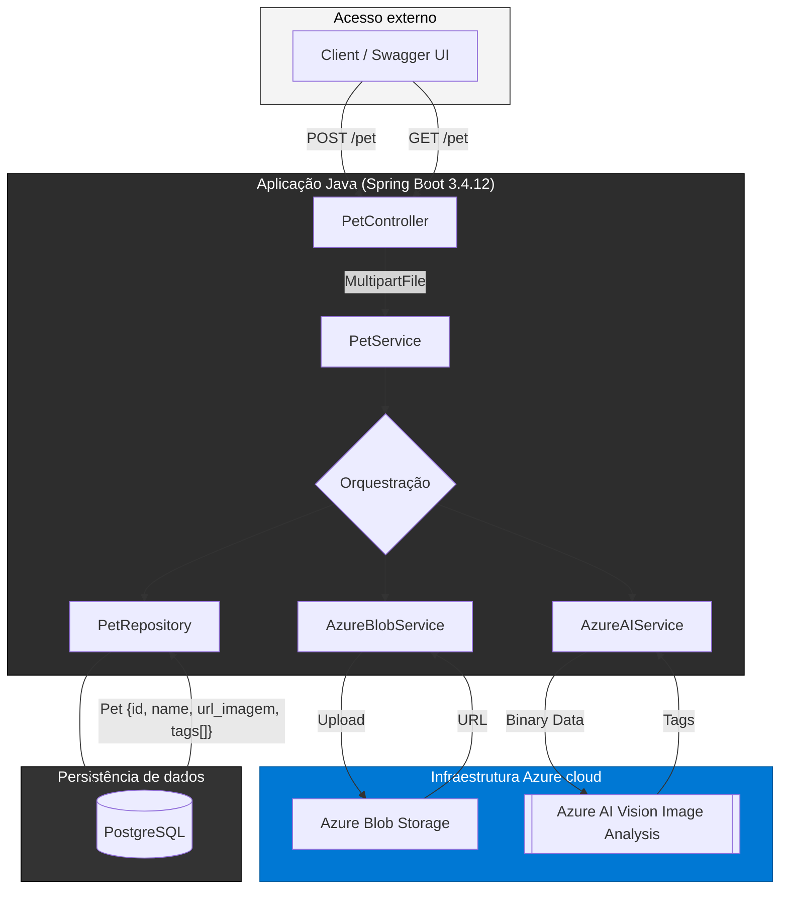

## Pet Cloud: Cadastro e classificação de pets 🐶

Um sistema desenvolvido em Java (Spring Boot), focado em gerenciar o cadastro de pets para adoção. O projeto utiliza serviços Azure para lidar com o armazenamento de imagens e a classificação automatizada das características do pet.

A arquitetura do projeto é dividida em camadas, com a API de Domínio (Java) orquestrando as operações de armazenamento e análise antes da persistência no banco de dados.

>[!IMPORTANT]
>Se quiser ver uma documentação mais detalhada sobre a arquitetura:
>
>[](https://app.gitbook.com/invite/3BzJD9kc8XUB2pCNxAEC/9gPjit0He8BL9usFzff5)


## Diagrama de fluxo




---

##  Funcionalidades principais

### Backend (API de domínio - Java/Spring Boot)

* **Upload de arquivos:** Gerencia a comunicação direta com o Azure Blob Storage para o armazenamento seguro das fotos de pets.
* **Análise de imagem (Tags):** Utiliza o Azure Custom Vision para gerar automaticamente rótulos (`tags`) da imagem, como raça, cor ou porte.
* **Persistência híbrida:** Salva no banco de dados relacional ( PostgreSQL) o registro do pet, a URL permanente da foto no Blob e a tag retornada pela análise.

---

##  Status dos serviços Azure

É crucial entender o status de implementação de cada serviço no projeto atual:

###  Azure Blob Storage (IMPLEMENTADO)

* **Status:** **Funcional e em produção.**
* **Uso:** O `AzureBlobService.java` está 100% implementado e é o serviço real responsável pelo upload e armazenamento das imagens dos pets, retornando a URL para uso.

###  Azure Custom Vision (SIMULAÇÃO)

* **Status:** **Em fase de simulação (Mockado).**
* **Uso:** O `CustomVisionService.java` está estruturado para receber o arquivo, mas a lógica de chamada à API do Custom Vision está simulada (mockada). Ele retorna uma *string* ou tag pré-definida no código para permitir que o fluxo de cadastro e o restante do projeto (salvar no banco com a tag) avancem sem a necessidade de uma conta Custom Vision totalmente treinada neste momento.

---
## Representação


---


---
## Gata especial


## ⚙️ Requisitos

* **Java JDK 21+**
* **Apache Maven (Wrapper incluído)**
* **Contas do Azure** para configurar as chaves de:
    * Azure Blob Storage (Connection String e nome do container).
    * Azure Custom Vision (Endpoint, Key, Project ID).

---

##  Como rodar

#### 1. Configuração

Garanta que as seguintes chaves estejam definidas no seu arquivo `application.properties`:

```properties
# CONFIGURAÇÃO AZURE BLOB STORAGE (REAL)
azure.storage.connection-string=SUA_CONNECTION_STRING
azure.storage.container-name=SEU_CONTAINER_DE_FOTOS

# CONFIGURAÇÃO AZURE CUSTOM VISION (SIMULADA)
custom.vision.endpoint=[http://mocked-endpoint.com](http://mocked-endpoint.com) # Pode ser um valor mockado
custom.vision.key=MOCKED_KEY
custom.vision.project-id=MOCKED_ID
